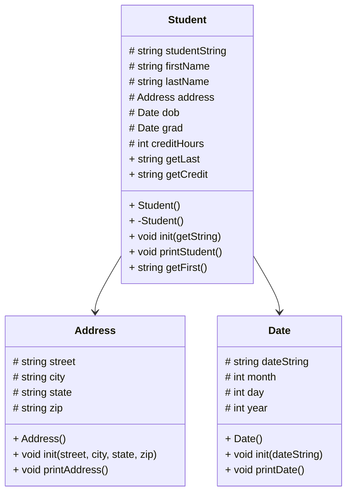

# CS121 Project 6

```mermaid
classDiagram

class Date {
# string dateString
# int month
# int day
# int year
+ Date()
+ void init(dateString)
+ void printDate()
}
class Address {
# string street
# string city
# string state
# string zip
+ Address()
+ void init(street, city, state, zip)
+ void printAddress()
}
class Student {
# string studentString
# string firstName
# string lastName
# Address address
# Date dob
# Date grad
# int creditHours
+ Student()
+ -Student()
+ void init(getString)
+ void printStudent()
+ string getFirst()
+ string getLast
+ string getCredit
}
Student --> Address
Student --> Date
```

## Goal
* Normalize data with three classes (date, address, student).
